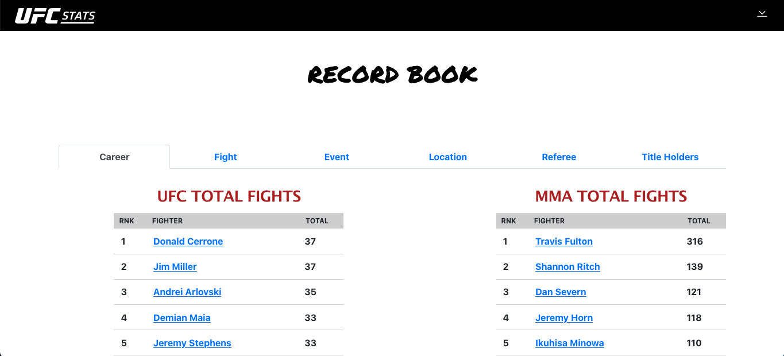

# Ultimate Fighting Championship

## How to use

Docker Dependencies:

 - Docker 
 - Docker Compose
  

```sh
$ docker-compose -f docker-compose.yml up
```


## HomePage


## Events


## Fighters


## Predictions


## Stats


## Rate


## 404 


